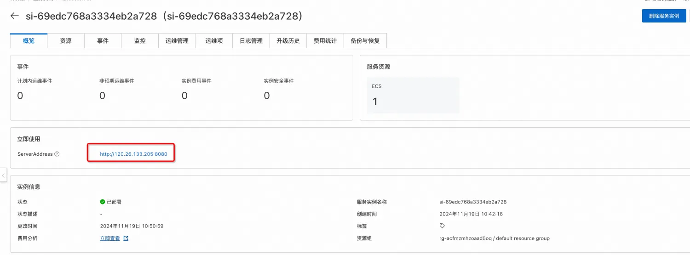

<h1>Open WebUI Service Instance Deployment Document </h1>

<h2> Introduction to Open WebUI and Ollama </h2>

Open WebUI is a feature-rich and user-friendly self-hosted Web user interface (WebUI) designed to interact with large language models (LLMs), especially those supported by Ollama or services compatible with the OpenAI API. Open WebUI provides the ability to run completely offline, which means that users can talk to models without an internet connection, which is especially important for data privacy and security-sensitive application scenarios.
Here are some of the key features of Open WebUI:
Intuitive interface: Open WebUI's interface is inspired by ChatGPT, providing a clear and user-friendly chat interface that makes interaction with large language models intuitive.
2. Extensibility: This platform is extensible, meaning that it can be customized and enhanced by adding new plug-ins or features to adapt to different usage scenarios and needs.
3. Offline operation: Open WebUI supports completely offline operation, does not rely on network connection, and is suitable for use on any device, whether on an airplane or in remote areas.
Compatibility: It is compatible with multiple LLM runers, including Ollama and OpenAI APIs, which allows users to select and run different language models from multiple sources.
Self-hosted: Users can deploy Open WebUI on their own servers or devices, which provides greater protection for data privacy and control.
Markdown and LaTeX support: Open WebUI provides comprehensive Markdown and LaTeX functionality that allows users to generate rich text output, which is useful in scientific and academic communication.
Local RAG integration: The Retrieval Enhanced Generation (RAG) feature allows the model to leverage locally stored data for more in-depth and specific responses, enhancing chat interactions. 

Ollama is an open source project whose main goal is to simplify the process of deploying and running large language models (LLMs) so that users can easily run them on their local machines or private servers without relying on cloud services. Here are some of the key features and functions of Ollama:
Simplified deployment: Ollama has designed a simplified process to deploy LLMs in Docker containers, which greatly reduces the complexity of managing and running these models, allowing non-specialists to deploy and use them.
Bundled model components: It packages a model's weights, configuration, and related data into a unit called a Modelfile, which helps to optimize the model's setup and configuration details, including GPU usage.
Ollama supports a range of large language models, including but not limited to Llama 2, Code Llama, Mistral, and Gemma. Users can choose and customize the model according to their specific needs.
4. Cross-platform support: Ollama supports macOS and Linux operating systems, and previews for Windows platforms have also been released, which makes it more compatible on different operating systems.
Command line operations: Users can start and run large language models with simple command line instructions. For example, to run the Gemma 2B model, you only need to execute the command ollama run gemma:2b.
6. Customization and extensibility: Ollama's design allows users to customize and create their own models according to specific needs, which provides the possibility of personalized use of models. 

 With Ollama, users get the following benefits:
* Privacy protection: Since the model runs locally, the data does not need to be uploaded to the cloud, thereby protecting the privacy of users.
* Cost savings: Avoid the cost of cloud services, especially for a large number of requests.
* Response speed: Local deployment can reduce latency and provide faster response time.
* Flexibility: Users can freely select and configure models to meet specific application needs. 

Open WebUI is integrated with Ollama, which can easily manage large models on the web interface and support online download. models supported by Ollama can be https://ollama.com/search here 

<h2> Billing instructions </h2>

 The cost of the Open WebUI panel on Alibaba Cloud mainly involves:
* Specifications of the selected GPU cloud server
* Disk Capacity
* Internet Bandwidth
Billing method: pay by volume (hour) or package year and month
The estimated cost can be seen in real time when the instance is created. 

<h2> Deployment Architecture </h2>

 The deployment architecture adopts ECS (cloud server) single-machine deployment 

<h2> Permissions required for RAM accounts </h2>

<table>
<thead>
<tr>
<th> Permission policy name </th>
<th> Remarks </th>
</tr>
</thead>
<tbody>
<tr>
<td>AliyunECSFullAccess</td>
<td> Permissions to manage ECS </td>
</tr>
<tr>
<td>AliyunVPCFullAccess</td>
<td> Permissions for managing VPC networks </td>
</tr>
<tr>
<td>AliyunROSFullAccess</td>
<td> Manage permissions for Resource Orchestration Services (ROS) </td>
</tr>
<tr>
<td>AliyunComputeNestUserFullAccess</td>
<td> Manage user-side permissions for the compute nest service (ComputeNest) </td>
</tr>
</tbody>
</table>

<h2> Deployment process </h2>

<h3> Deployment steps </h3>

<ol>
<li> Click the deployment link to enter the service instance deployment interface, and fill in the parameters according to the interface prompts to complete the deployment. </li>
<li> after completing the parameters, you can see the corresponding inquiry details. after confirming the parameters, click <strong> next step: confirm the order </strong>
</li>
<li> Confirm the order and agree to the service agreement and click <strong> Create Now </strong></li>
<li> After the deployment is completed, you can start using the service. Enter the service instance details and click Address to access it.

5. Use of Services
</li>
</ol>
